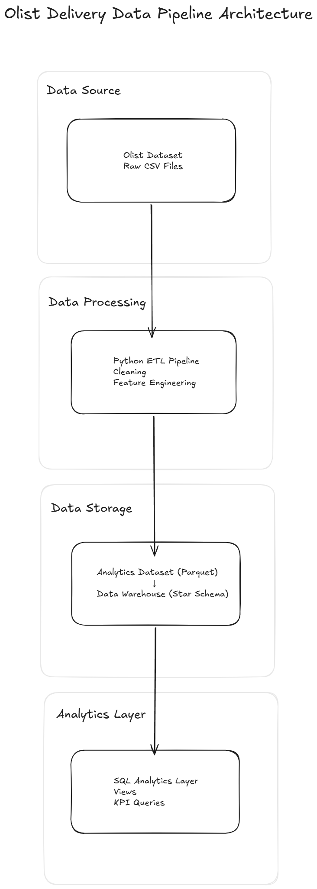

# Olist Delivery Data Pipeline

## Project Overview

End-to-end analytical data pipeline built using the Brazilian Olist E-Commerce dataset.

This project transforms raw transactional data into an analytics-ready dataset and a dimensional SQL warehouse model, enabling Business Intelligence and Machine Learning use cases.

---

## Architecture



The pipeline follows a layered data architecture separating data ingestion, processing, storage, and analytics.

Pipeline flow:

Raw CSV Data → Python ETL Pipeline → Analytics Dataset (Parquet) → Data Warehouse (Star Schema) → SQL Analytics Layer

---

## Architecture Layers

### Data Source

Raw transactional CSV files from the Olist dataset.

### Data Processing

Python ETL pipeline responsible for:

* Data cleaning
* Feature engineering
* Metric creation
* Data filtering

### Data Storage

Two storage layers are produced:

* **Analytics Dataset (Parquet)** optimized for analytical workloads
* **Dimensional Data Warehouse** implemented using a Star Schema

### Analytics Layer

SQL views and analytical queries enabling KPI analysis and Business Intelligence reporting.

---

## Objective

Design and implement a complete data pipeline to:

* Process raw e-commerce data
* Engineer delivery performance metrics
* Create an analytics-ready dataset
* Model a dimensional Data Warehouse using Star Schema
* Enable SQL-based analytical queries for BI

---

## Dataset

Source: Brazilian E-Commerce Public Dataset by Olist
Period: 2016–2018
Orders: ~100,000

Main tables used:

* orders
* order_items
* customers
* sellers
* products

The dataset represents a real-world Brazilian marketplace containing transactional, customer, seller, and logistics information.

---

## Python Analytical Pipeline

### Pipeline Steps

1. Raw CSV ingestion
2. Date parsing and null handling
3. Feature engineering
4. Filtering of delivered orders
5. Generation of analytics dataset
6. Persistence in Parquet format

---

### Core Metric

`delivery_time_days`

Calculated as:

delivery_date - purchase_timestamp

This metric measures logistics performance and delivery efficiency.

---

### SLA Analysis

P95 delivery time: **29 days**

Meaning **95% of delivered orders arrive within 29 days**.

This KPI allows monitoring logistics performance and validating delivery SLA expectations.

---

## Data Warehouse Layer (SQL)

A dimensional Data Warehouse was implemented using a **Star Schema** to optimize analytical queries.

### Fact Tables

* `fact_orders`
* `fact_order_items`

### Dimension Tables

* `dim_customer`
* `dim_seller`
* `dim_product`

---

### Analytical Capabilities

The SQL layer supports analytics such as:

* Revenue by state
* Revenue by product category
* Monthly revenue trends
* Aggregated KPIs
* Logistics performance metrics

All SQL scripts are located in the `/sql` directory.

---

## Technical Decisions

* Only `order_status = delivered` considered to avoid skewed SLA metrics
* Null values were not imputed to preserve statistical integrity
* Parquet chosen for analytical efficiency and ML compatibility
* Star Schema adopted for BI scalability and query performance

---

## Project Structure

```
data/
├── raw/
├── analytics/

docs/
└── architecture.png

etl/
└── run_pipeline.py

notebooks/
└── 01_exploratory_analysis.ipynb

sql/
├── 01_create_tables.sql
├── 02_insert_data.sql
├── 03_views.sql
└── 04_analytics_queries.sql

README.md
```

---

## Skills Demonstrated

* ETL Pipeline Development
* Data Cleaning & Transformation
* Feature Engineering
* Analytical Metric Design
* Dimensional Modeling (Star Schema)
* SQL Analytics
* Data Persistence Optimization (Parquet)
* BI-Oriented Data Structuring

---

## How to Run

Place raw CSV files inside:

```
data/raw/
```

Run the pipeline:

```
python etl/run_pipeline.py
```

The processed dataset will be generated in:

```
data/analytics/
```

---

## Future Improvements

Planned enhancements for production-level architecture:

* Pipeline orchestration with Apache Airflow
* Cloud deployment using AWS (S3 + RDS)
* Automated testing for pipeline validation
* Data quality checks
* Dashboard integration (Power BI / Looker)
* CI/CD for pipeline automation
